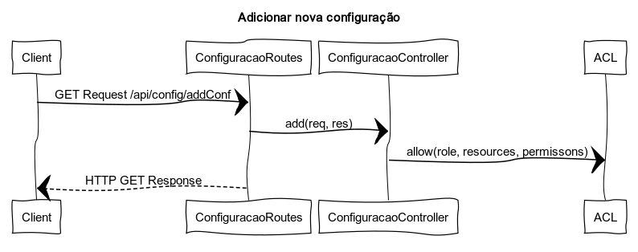
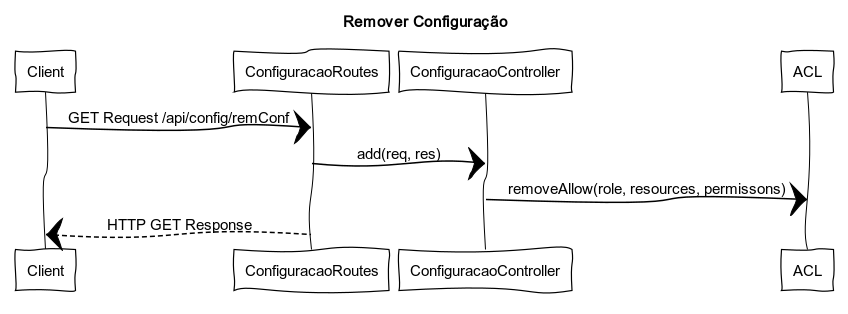

# Alterar Configurações por papel

- Como Product Owner, pretendo que seja possível alterar por configuração (sem compilação ou reinstalação) as autorizações de execução das ações de gestão de encomendas e clientes.

## Análise

- É solicitado a adição de uma autorização para um determinado papel, atraves de um POST via HTTP.
- A alteração é adicionada das configurações pré-existentes.
- No final, é enviado uma resposta positiva ou negativa mediante o sucesso ou falha da operação.

OU

- É solicitado a remoção de uma autorização para um determinado papel.
- A alteração é removida das configurações pré-existentes.
- No final, é enviado uma resposta positiva ou negativa mediante o sucesso ou falha da operação.

## Design 

### ACL

- Access-Control List vai ser usado para cada role/papel atribuir permissões para cada recurso disponibilizado.

### Autorizações Base

| Papel | Recurso | Permissões |
|:-----|:-----|:-----|
| Admin | Encomendas | Consultar |
|| Clientes | Consultar |
|| Encomenda | Consultar, Alterar, Cancelar |
|| Cliente | Consultar, Alterar |
|| Stats | Consultar |
|| Configuracao | Adicionar, Consultar, Remover |
| Client | Encomenda | Criar, Consultar, Alterar, Cancelar |
|| Cliente | Criar, Consultar, Alterar, Eliminar |
|| Stats | Consultar |

### Diagrama Sequência da Adição

### Diagrama Sequência da Remoção

