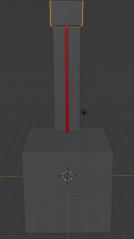

# Importação de modelos para as Máquinas

- Com o recurso ao Blender, vão ser criados modelos individualizados para cada máquina, mediante o seu tipo. Para prova de conceito vão ser criados 3 tipos de máquina em que 2 desses tem ferramentas diferentes:

    - Furadora (com ferramenta mecânica e laiser);
    - Esmagadora (com ferramenta quadrada e redonda);
    - Forno (apenas uma ferramenta que é a grelha);

## Furadora Mecanica

## Furadora Laiser

## Esmagadora Quadrada

## Esmagadora Redonda

## Forno

